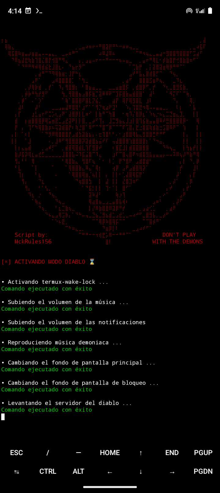
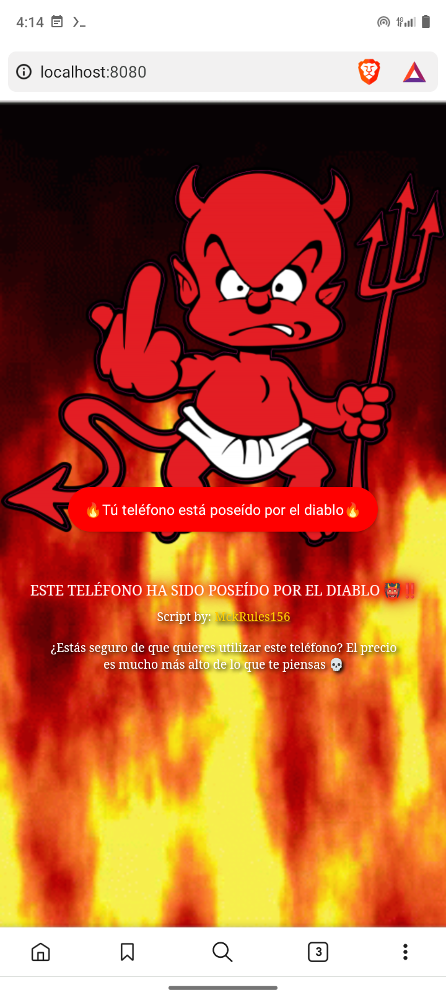
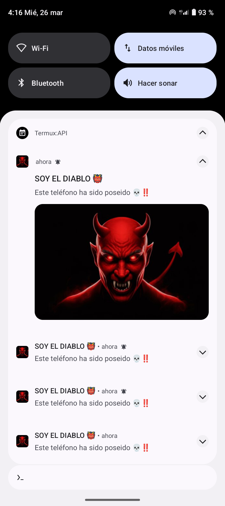
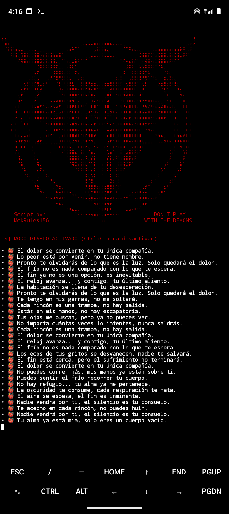
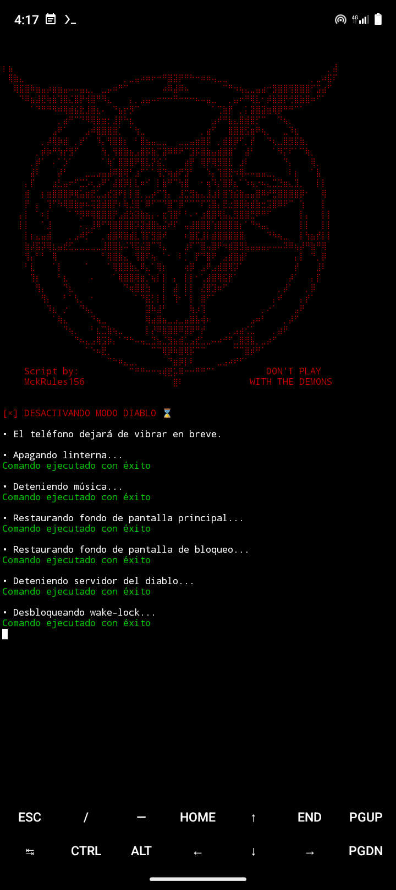
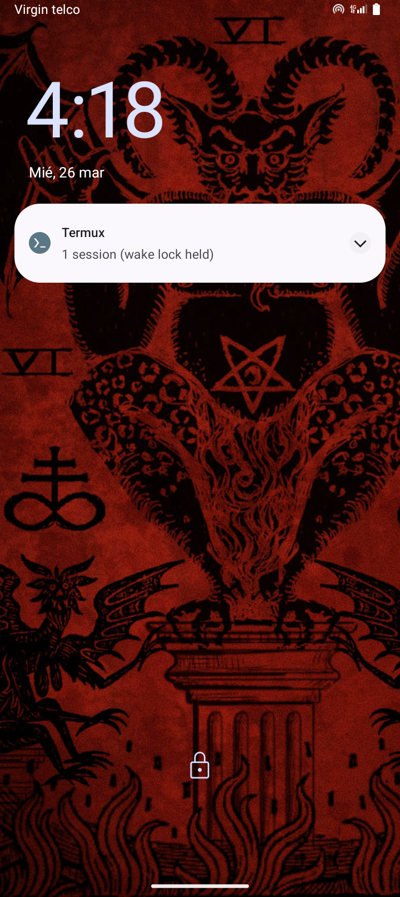

     


# ModoDiablo 👹
**Este script no solo ejecuta comandos, invoca fuerzas más allá de lo comprensible ...**  


## Descripción 📄

¡Bienvenido al **lado oscuro** de la tecnología! **ModoDiablo** es un script en **Termux** diseñado para convertir tu teléfono en un **portal digital hacia el infierno**. Prepárate para vivir una experiencia aterradora, donde los límites entre lo real y lo sobrenatural se desdibujan.

Este script transforma tu dispositivo en una **entidad poseída**, desatando efectos perturbadores como **sonidos demoníacos**, **vibraciones inexplicables**, y un **servidor demoníaco** que se manifiesta de maneras insólitas. Desde **notificaciones espeluznantes** hasta cambios en la apariencia de tu teléfono, cada acción está cuidadosamente diseñada para crear una atmósfera de terror.

Ya sea que desees asustar a tus amigos, sorprender a alguien con un toque macabro o simplemente experimentar con lo paranormal, **ModoDiablo** está aquí para poner a prueba tus nervios. Porque recuerda: el diablo no necesita tu alma… solo tu teléfono.

**¿Estás listo para desatar el caos?** 

## Compatibilidad 📲

Este script es compatible con **Termux**. Para un funcionamiento completo, es necesario tener instalada la extensión **Termux:API**, que proporciona acceso a diversas funcionalidades del sistema.  


## Características ⭐

Este script desatará una serie de efectos demoníacos en tu dispositivo, convirtiéndolo en un portal digital hacia el infierno. Algunas de las características incluyen:

**1. Voz Demoníaca**: Se oirá una voz demoniaca que advierte que tu dispositivo ha sido poseído, seguida de una risa diabólica y una melodía satánica que pondrá los pelos de punta.
   
**2. Cambio de Fondo de Pantalla**: Tu fondo de pantalla se transformará en una imagen tenebrosa, dándole a tu teléfono una atmósfera oscura y espeluznante.
   
**3. Vibración Incesante**: El teléfono comenzará a vibrar de manera interminable, generando una sensación inquietante y descontrolada.
   
**4. Linterna Intermitente**: La linterna de tu teléfono se encenderá y apagará sola, como si estuviera controlada por fuerzas oscuras.
   
**5. Mensajes Flotantes**: Aparecerán mensajes flotantes en tu pantalla, con contenido aterrador y mensajes del otro lado.
   
**6. Notificaciones del Diablo**: Recibirás notificaciones misteriosas y aterradoras del propio diablo, aumentando la tensión y el desconcierto.
   
**7. Mensajes en la Terminal**: La terminal mostrará mensajes tenebrosos en tiempo real, como si tu teléfono estuviera poseído por una entidad maligna.
   
**8. Servidor Demoníaco**: Se creará un servidor demoníaco en segundo plano y se abrirá automáticamente en el navegador, proporcionando una experiencia aún más inquietante.

## Screenshots 📸

<div>
  
  
  
</div>

<div>
  
  
  
</div>


## Instalación del script 💻

#### 1. Instalar Termux
Si aún no tienes **Termux** instalado, puedes hacerlo desde [Termux (F-Droid)](https://f-droid.org/packages/com.termux/).

#### 2. Instalar la extensión Termux:API
Simplemente dirigete al siguiente enlace para descargar la extensión [Termux:API (F-Droid)](https://f-droid.org/packages/com.termux.api/).

#### 3. Instalar ModoDiablo
Ejecuta los siguientes comandos en la terminal de **Termux**

```bash
git clone https://github.com/MckRules156/ModoDiablo.git
cd ModoDiablo
chmod +x Instalador.sh
bash Instalador.sh
bash ModoDiablo.sh
```

## Configuraciones del script ⚙️

#### 1. Configuración de los mensajes macabros que se muestran en la terminal
Para configurar estos mensajes puedes modifcar la variable "Mensajes" del script "ModoDiablo.sh"

#### 2. Configuración del temporizador del script
En la función "timer" del script "ModoDiablo.sh" puedes modificar el tiempo de espera del temporizador

#### 3. Configuración del audio del script
Puedes cambiar el audio del script remplazando el archivo "Media/music.mp3" por el audio que prefieras

#### 4. Configuración de fondos de pantalla
Reemplaza el archivo "Media/oldwallpaper.jpg" por tu fondo de pantalla actual y "Media/oldwallpaperlock.jpg" por tu fondo de pantalla de bloqueo. El script utilizará estos archivos para restaurar tus fondos originales cuando se detenga.

## Solución de problemas 🛠️

Si encuentras problemas al ejecutar el instalador `Instalador.sh`, es posible que se deba a la falta de algunas dependencias. Si esto ocurre, puedes instalarlas manualmente con los siguientes pasos:

Abre **Termux** y ejecuta los siguientes comandos para instalar las dependencias necesarias:

```bash
pkg install php -y
pkg install termux-tools -y
pkg install termux-api -y
pkg install xdg-utils -y
pkg update && pkg upgrade -y
```

## ¿Cómo utilizar el script? 🚀

**1. Utilizar el script para uso particular:**
Para ejecutar el script, asegúrate de haber completado la instalación sin errores y simplemente dirígete a la carpeta "ModoDiablo" y ejecuta el script "ModoDiablo.sh"

```bash
cd ModoDiablo
bash ModoDiablo.sh
```

**2. Utilizar el script para sorprender a un amigo (Con su consentimiento):**
Si tu objetivo es sorprender a un amigo, puedes programar un temporizador antes de ejecutar el script y encontrar una excusa para prestarle tu teléfono. Una vez que tu amigo esté usando tu dispositivo y el temporizador llegue a su fin, el script comenzará a ejecutarse de manera inesperada. En ese momento, tu amigo probablemente se quedará desconcertado, preguntándose: "¿Qué está pasando aquí?". Dado lo surrealista y extraño de este script, cualquiera en esa situación se verá totalmente desconcertado,

Para ello puedes ejecutar el siguiente comando: (Permite que Termux pueda ejecutarse en segundo plano y programa un temporizador de 1 minuto antes de iniciar el script)

```bash
termux-wake-lock && sleep 60 && bash ModoDiablo.sh
```
Si deseas llevar la experiencia al siguiente nivel, intenta instalar el script en el teléfono de otra persona sin que se percate, y programa su ejecución. Te garantizo que, en ese caso, la sorpresa será mucho más impactante.

## Aviso Legal ⚖️

Este script ha sido creado con fines de entretenimiento y educativos. Si decides usarlo con otros fines, como sorprender a alguien, asegúrate de obtener su consentimiento y no causarle molestias. Es responsabilidad del usuario asegurarse de que su uso no infrinja las leyes locales, nacionales o internacionales. Los desarrolladores no se hacen responsables de ningún mal uso ni de los daños causados. ¡Utiliza este script con responsabilidad y respeto!


## Donaciones 💸

Si te gusta lo que hago y quieres contribuir para seguir mejorando este proyecto, aquí te dejo varias formas en las que puedes apoyarme. Tu aportación hace la diferencia.

#### Criptomonedas 🪙 :
- **Bitcoin (BTC)**: bc1qdmxh86s30nm3nrdrstvggeaswjxz6pf2pmatxw
- **Ethereum (ETH)**: 0x03E3595E23A52A60e926FD549563DdB549454DF9
- **Dogecoin (DOGE)**: DTP7no4aHFQwLT7JTn8Ly4vBDo7LfHcRzJ
- **Monero (XMR)**: 4AsS593c1Q7abg9Ks8YfooigrAQhrpWqRcjQULjT2MmvDi9Q74ybFWTWyTQ1d7PkJADuSUwVkuxhdicukZJg6FPZ4y8e4Xx

Tu apoyo me permite seguir trabajando en proyectos como este. ¡Gracias por estar aquí!

## Contacto 📬
Si tienes alguna pregunta o sugerencia, puedes contactarme a través de:
- Correo electrónico: [MckRules156@proton.me](mailto:MckRules156@proton.me)
- GitHub: [@MckRules156](https://github.com/MckRules156)


